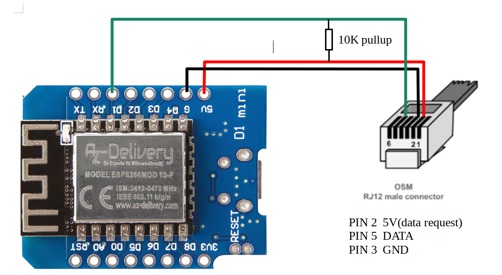

# eww_ewerk_wels_smartmeter_readout
How to readout smartmeter values with a esp8266 from the Siemens IM350 smartmeter provided by eww / ewerk wels

## first you have to activate smartmeter function

you can do this online under: https://mein.eww.at/de/registrierung

it took in my case around 1day till i was able to readout the aes key on their site

Unfortunate the smartmeter don't deliever 5V so you have to power your esp8266 with something else (i powered it via the usb port with external usb power supply)

## you need a esp8266

i use a wemos d1 mini with following wiring (powered d1 external with usb)

### wiring

 

###

arduino program which delivers serial stream via tcp on port 1337

./arduino/ESPsmartmeter.ino

## python program to readout values

https://pypi.org/project/gurux-dlms/

###

decoding example in ./src/decode_example.py

## links

### HDLC
https://notblackmagic.com/bitsnpieces/ax.25/

https://www.slideshare.net/sonangrai/hdlchigh-level-data-link-control-102553867

### gurux dlms
https://www.gurux.fi/node/14733

https://www.gurux.fi/node/16639

https://github.com/Gurux/GuruxDLMS.c/blob/master/Arduino_IDE/client/client.ino

https://www.youtube.com/watch?v=ZMGGslFcjtw

http://www.gurux.fi/OpenSource

https://www.gurux.fi/node/15268

https://github.com/Gurux/Gurux.DLMS.Python.git

### unsorted
https://stadtwerkeschwaz.at/pdfs/Technische%20Beschreibung%20Kundenschnittstelle%20SWS%20Smart%20Meter.pdf

https://github.com/culvermelanie/SmartMeter

https://www.mikrocontroller.net/attachment/548195/DLMS_COSEM_APDU.png

https://github.com/ric-geek/DLMS-APDU-Encrypter-Decrypter

https://www.anycodings.com/1questions/4226765/how-calculate-checksum-in-hdlc-frame

https://www.photovoltaikforum.com/core/attachment/103208-kundenschnittstelle-imx50-pdf/

https://svrooij.io/smartmeter2mqtt/advanced/decryption.html

https://community.openhab.org/t/dsmr-binding-for-austrian-smart-meters/90649/20?page=2

https://community.openhab.org/t/dsmr-binding-for-austrian-smart-meters/90649/4

https://www.metsys.hu/pdf/zmg410/felhasznaloi_kezikonyv_z.x.g400.pdf

https://cdn.standards.iteh.ai/samples/10747/b6448cb38dd84593994c3cf37f8533a9/IEC-62056-46-2002.pdf

https://www.ungelesen.net/protagWork/media/downloads/solar-steuerung/iec62056-21%7Bed1.0%7Den_.pdf

https://saso.gov.sa/ar/mediacenter/public_multimedia/Documents/SASO-IEC-62056-46-E.pdf

https://global.ihs.com/doc_detail.cfm?document_name=IEC%2062056%2D46&item_s_key=00393601

https://law.resource.org/pub/in/bis/S05/is.iec.62056.53.2006.pdf

https://www.dlms.com/files/Green-Book-Ed-83-Excerpt.pdf

## iec62056-42

you can buy it here: https://webstore.iec.ch/preview/info_iec62056-46%7Bed1.0%7Den.pdf

if you have question to the standard pm me (;

